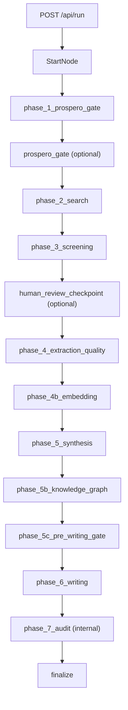

# Architecture

## Purpose

Automate systematic reviews from research question to submission artifacts with deterministic evidence, reproducible persistence, and auditable LLM usage.

## Runtime planes

- **API and orchestration:** `src/web/app.py` (mount + `/runs/*` + SPA), `src/web/routers/` (all `/api/*` routes), `src/web/path_guard.py`, `src/orchestration/workflow.py`, `src/orchestration/resume.py`
- **Data plane:** per-run `runtime.db` (`src/db/schema.sql`)
- **Control plane:** `runs/workflows_registry.db` (`src/db/workflow_registry.py`)
- **Frontend:** `frontend/src/` with typed API in `frontend/src/lib/api.ts`
- **Artifacts:** run outputs under `runs/YYYY-MM-DD/...`

## Invariants

- Fix behavior in `src/` and `frontend/src/`, never by editing `runs/` artifacts.
- Typed models at phase boundaries (`src/models/`).
- No LLM-computed statistics when deterministic code exists.
- LLM calls logged in `cost_records` with model and token accounting.
- Model IDs from `config/settings.yaml`, not hardcoded in source.
- Unknown `settings.yaml` keys are dropped by `SettingsConfig`; `load_configs` logs a warning via `find_unknown_settings_keys` (`src/config/loader.py`) and `tests/unit/test_settings_unknown_keys.py` locks the repo file.
- Cross-artifact numbers (PRISMA counts, included cohort, kappa) come from `ReviewFacts` (`src/manuscript/review_facts.py`), not ad hoc queries.

## Canonical paths

| Concern | Path |
|---------|------|
| Runtime graph | `src/orchestration/workflow.py` (`RUN_GRAPH`) |
| Phase order | `src/orchestration/phase_catalog.py` (`PHASE_ORDER`) |
| Typed contracts | `src/models/` |
| DB schema | `src/db/schema.sql` |
| Registry | `src/db/workflow_registry.py` |
| Stats truth | `src/db/source_of_truth.py`, `src/db/stats.py` |
| Review facts | `src/manuscript/review_facts.py` (`ReviewFacts`, `build_review_facts`) |
| Jev client | `src/llm/jev_client.py` |
| API routers | `system`, `config`, `run_lifecycle`, `history`, `database_explorer`, `costs`, `validation`, `artifacts`, `screening_review`, `advanced`, `prospero_gate`, `workflow_draft` |
| Frontend API | `frontend/src/lib/api.ts` |
| Frontend phases | `frontend/src/lib/constants.ts` |

Build phases (1-8) are planning labels. Runtime checkpoints use `phase_catalog.py` keys. Do not mix the two naming systems.

---

## Pipeline

Visual end-to-end map (entry points, connectors, delivery): [SYSTEM_DIAGRAM.md](./SYSTEM_DIAGRAM.md).

### Agent lifecycle stages

Think → Plan → Build → Review → Test → Ship (route via `docs/CONTEXT.md`).

### Runtime checkpoint order

`PHASE_ORDER` in `src/orchestration/phase_catalog.py`:

1. `phase_1_prospero_gate`
2. `phase_2_search`
3. `phase_3_screening`
4. `phase_4_extraction_quality`
5. `phase_4b_embedding`
6. `phase_5_synthesis`
7. `phase_5b_knowledge_graph`
8. `phase_5c_pre_writing_gate`
9. `phase_6_writing`
10. `phase_7_audit` (internal; not user-resumable)
11. `finalize`

`phase_7_audit` stays in `PHASE_ORDER` but is excluded from `USER_RESUMABLE_PHASE_ORDER` and frontend resume controls.

### Runtime map

### Checkpoint taxonomy

- **Canonical order:** `phase_catalog.py` (`PHASE_ORDER`)
- **User-resumable:** `USER_RESUMABLE_PHASE_ORDER`
- **Frontend resume:** `RESUME_PHASE_ORDER` in `constants.ts` (must match backend)
- **Frontend display:** `PHASE_ORDER` (may include UI-only stages like `fulltext_pdf_retrieval`)
- **Rewind:** `WorkflowRepository.rollback_phase_data`

### Human gates

| Status | Trigger | Resume |
|--------|---------|--------|
| `awaiting_review` | Screening HITL | `POST /api/run/{run_id}/approve-screening` + resume |
| `awaiting_prospero` | PROSPERO gate | `POST /api/run/{run_id}/submit-prospero` |

Web mode parks via `End(WorkflowRunResult)`; CLI may poll or exit.

### Terminal status and audit gate

`gates.audit_gate_mode` (`advisory` | `strict` | `needs_revision`; repo default `needs_revision`) decides what a blocking contract/audit result does (`src/orchestration/helpers/manuscript_gate.py`):

- `advisory`: run finishes `completed`; audit report kept.
- `needs_revision`: all artifacts still produced; finalize sets status `needs_revision` (`WorkflowRunStatus.NEEDS_REVISION`).
- `strict`: pipeline stops before finalize.

---

## Persistence

### Databases

- **Runtime DB:** `runs/.../runtime.db` (schema: `src/db/schema.sql`)
- **Registry:** `runs/workflows_registry.db` (`src/db/workflow_registry.py`)

### Table families (runtime)

Search/corpus, screening, extraction/cohort, synthesis/graph, writing/manuscript, control plane (`workflow_steps`, `checkpoints`, `event_log`), validation/audit, `cost_records`.

### Truth rules

- **Included studies:** `study_cohort_membership` with `synthesis_eligibility='included_primary'`
- **Costs:** `cost_records`
- **Registry:** use `db_path` from registry rows; do not guess paths
- **Cross-artifact facts:** `build_review_facts()` assembles PRISMA counts, `included_primary` ids, and kappa. Consumers: pre-writing gate, writing setup, audit runner, manuscript contracts, readiness, PRISMA flow export. `validate_cross_artifact()` mismatches become a blocking `review_facts_cross_artifact` check (gate/readiness) or contract violation.
- **Jev decisions:** `jev_decisions` table (created in `src/db/database.py` migrations), one row per Jev call with mode/latency/tokens/cost in `details_json`.

### Resume and rewind

Checkpoints via `src/orchestration/resume.py`. Rewind clears downstream artifacts, step journals, and recovery policies through `rollback_phase_data`.

---

## LLM and costs

### Configuration

All model IDs in `config/settings.yaml`. Default chat agents are Fireworks task tiers (`FIREWORKS_API_KEY`); `google:` models are used only for diagram image agents (`GEMINI_API_KEY`). Use `complete_validated()` for structured LLM output.

Current tiers: flash `deepseek-v4p1-flash`, pro `glm-5p3`, adjudicator `gpt-oss-120b`, vision `minimax-m3`, diagram critic `google:gemini-3.5-flash`. Verify ids against the live provider API before changing them (Fireworks retired `deepseek-v4-flash-0731`/`-pro-0813` and Google retired `gemini-2.5-flash` for new keys in Sep 2026).

Hidden reasoning is bounded in `src/llm/pydantic_client.py` `reasoning_extra_body()`: DeepSeek thinking is disabled for all calls and Fireworks GLM (thinking-only) runs at `reasoning_effort: medium`. At default effort GLM spent ~10x the output tokens and latency on section prompts.

Section post-processing, quality scoring, and manuscript assembly run via `asyncio.to_thread` so CPU-heavy writing steps never block the web event loop (workflows share the API process).

The shared rate limiter (`src/llm/shared_rate_limiter.py`) is keyed on a hash of the provider key env vars actually used by configured agents, so runs sharing provider keys share one limiter.

### Cost surfaces

- Per-run: `/api/db/{run_id}/costs`, `.../aggregates`, `.../export`
- Global: `/api/history/costs/aggregates`, `.../export`

Filters use `cost_records.created_at`. LLM call sites pass `workflow_id` into `cost_records`. Jev calls log phase `<phase>_jev` (live) or `jev_shadow_<phase>` (shadow).

### Screening funnel (cost control)

1. BM25 rank
2. `max_llm_screen` cap
3. `batch_screen_*` pre-rank
4. Dual-reviewer screening (`reviewer_batch_size`)

Default recall-first profile in `config/settings.yaml`: `max_llm_screen: 200`, `batch_screen_threshold: 0.30`, `reviewer_batch_size: 10`. Raise threshold only after replay validation. The cap is raised to `jev.screening_cap_when_enabled` (1000) only when `jev.screening_reviewer_b` is `live`.

### Jev decision layer

TypeSafe Jev typed-decision API via `src/llm/jev_client.py` (`TYPESAFE_API_KEY`, pinned `jev.model`). Fail-open to the LLM path.

| Surface (`jev.*`) | Module | `live` behavior |
|-------------------|--------|-----------------|
| `screening_reviewer_b` | `src/screening/jev_screening.py` | Jev is reviewer B; low confidence escalates to LLM |
| `batch_pre_rank` | `src/screening/jev_batch_ranker.py` | Jev scores every paper; LLM on failure |
| `study_design` | `src/extraction/jev_study_design.py` | Confident Jev answer skips the LLM classifier |
| `rag_rerank` | `src/rag/jev_rerank.py` | Jev chunk order; LLM reranker on failure |

- Modes: `off` | `shadow` | `live` (bools accepted: `true`→`live`, `false`→`off`). `jev.enabled: false` forces all off. Repo: `screening_reviewer_b: off` (2026-09-26 live eval: Jev include recall 0.40 vs LLM 0.69), other surfaces `shadow`.
- `shadow`: LLM decision is used; Jev runs side-by-side (bounded by `shadow_concurrency`) and is recorded in `jev_decisions`.
- Thresholds: `route_confidence` (include/uncertain), `exclude_confidence` (exclude, conservative).
- Cost: `price_per_call_usd`, `price_input_per_mtok`, `price_output_per_mtok` (0.0 logs $0; set from the TypeSafe price sheet).
- Offline eval: `uv run python scripts/check.py jev-eval --db <runtime.db>` (agreement, include recall/precision, kappa, threshold sweep, latency, cost). `--live-sample N --confirm-live` re-screens N papers with external calls; never writes to the run DB.
